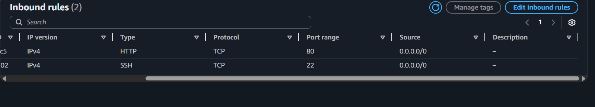
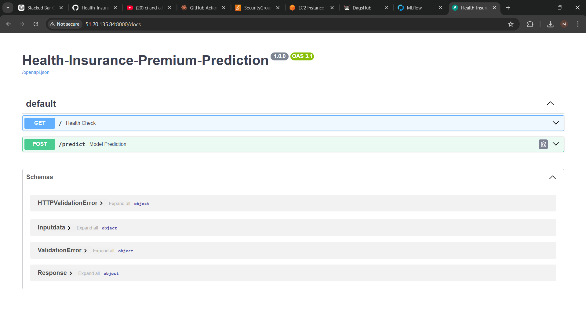
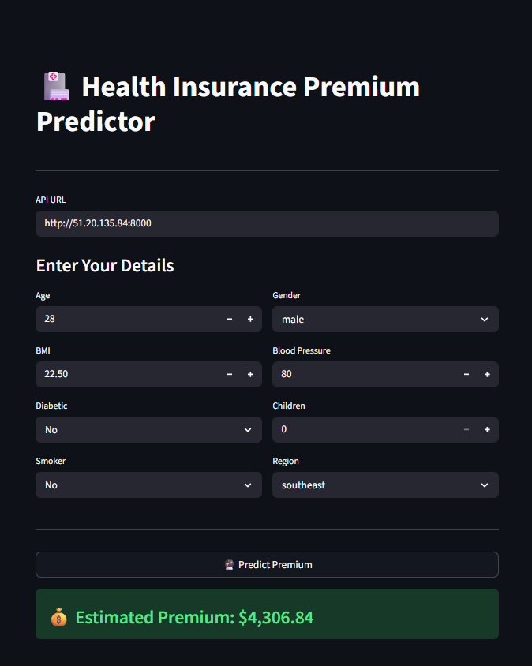
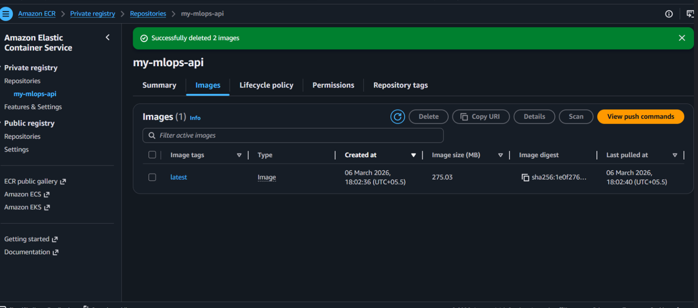

# 🏥 Health Insurance Premium Predictor — End-to-End MLOps Project

<p align="center">
  
  
  
  
  
  
  
</p>

> **A fully automated, production-grade MLOps system** that trains, evaluates, registers, containerizes, and deploys a machine learning model to AWS EC2 — triggered entirely by a single `git push`.

---

## 📸 Project Showcase

| FastAPI Live on AWS EC2 | Health Insurance Prediction UI |
|:-:|:-:|
|  |  |

| AWS ECR — Docker Image Registry | EC2 Security Group Rules |
|:-:|:-:|
|  |  |

## 🧩 Business Problem

### The Challenge

Health insurance companies operate in a high-risk financial environment. They collect premiums **upfront** and pay out medical claims **later** — meaning every mispriced policy is a direct loss.

> **If premiums are set too low** → the company pays more in claims than it collects → financial loss.
> **If premiums are set too high** → customers leave for competitors → loss of market share.

The core challenge is: **how do you accurately estimate how much a customer will cost you, before they ever file a claim?**

### 💡 The Solution

Build a **data-driven regression model** that predicts a customer's expected annual medical insurance claim amount based on their personal health profile — enabling the company to price every policy with precision, at scale, in milliseconds.

### 📊 Business Impact

| KPI | Without ML | With ML |
|-----|-----------|---------|
| 📉 **Claim Ratio** (Claims / Premiums) | High — many policies underpriced | Reduced — risk priced correctly |
| 📈 **Profit Margin** | Thin — rough actuarial estimates | Improved — data-driven premium setting |
| 🎯 **Pricing Accuracy** | Manual, rule-based broad tiers | Personalized per-customer prediction |
| 💰 **Customer Lifetime Value (CLV)** | Low retention due to mispricing | Higher — fair pricing builds trust |
| ⚡ **Time to Price a Policy** | Days (manual underwriting) | Milliseconds (API response) |

### 🔍 Risk Factors Modeled

The model captures **8 key health and demographic signals** that directly influence expected medical costs:

- 🎂 **Age** — older customers statistically file larger claims
- ⚖️ **BMI** — high BMI correlates strongly with chronic disease risk
- 🚬 **Smoking Status** — the single biggest cost driver in insurance modeling
- 🩸 **Diabetic Status** — diabetes leads to recurring, high-cost treatments
- 💉 **Blood Pressure** — elevated BP increases cardiovascular claim risk
- 👨‍👩‍👧 **Number of Children** — more dependents means higher family coverage cost
- 🧭 **Region** — geographic variation in healthcare costs across the US
- ⚥ **Gender** — demographic risk adjustment factor

---

## 🏗️ System Architecture

```
┌─────────────────────────────────────────────────────────────┐
│                    Developer Pushes to master               │
└────────────────────────────┬────────────────────────────────┘
                             │
                             ▼
┌─────────────────────────────────────────────────────────────┐
│               CI PIPELINE  (GitHub Actions)                 │
│                                                             │
│  1. Checkout Code                                           │
│  2. Setup Python 3.12 + Install Dependencies               │
│  3. Configure AWS Credentials                               │
│  4. DVC Pull  ──────────────────── pulls data from S3      │
│  5. DVC Repro ──────────────────── runs full ML pipeline   │
│     ├── Stage 1: Data Ingestion                             │
│     ├── Stage 2: Feature Engineering                        │
│     ├── Stage 3: Model Building                             │
│     └── Stage 4: Evaluation + MLflow Logging               │
│  6. Pytest ────── unit + integration + api + validation    │
│  7. model_promote.py ──── push best model to Production    │
└────────────────────────────┬────────────────────────────────┘
                             │ on success
                             ▼
┌─────────────────────────────────────────────────────────────┐
│               CD PIPELINE  (GitHub Actions)                 │
│                                                             │
│  1. Build Docker Image                                      │
│  2. Push Image ──────────────────── AWS ECR (latest)       │
│  3. SSH into EC2                                            │
│     ├── Pull latest image from ECR                         │
│     ├── docker stop mlops-api                              │
│     ├── docker rm   mlops-api                              │
│     └── docker run  mlops-api  -p 8000:8000                │
└────────────────────────────┬────────────────────────────────┘
                             │
                             ▼
              ┌──────────────────────────┐
              │  FastAPI App on AWS EC2  │
              │  http://<IP>:8000/docs   │
              └──────────────────────────┘
```

---

## 🗂️ Project Structure

```
insurance_predictor/
│
├── .github/
│   └── workflows/
│       ├── ci.yaml                     # CI — train, test, promote
│       └── cd.yaml                     # CD — build, push, deploy
│
├── app/                                # FastAPI application
│   ├── config.py                       # App config (model path, settings)
│   ├── main.py                         # API entrypoint & route definitions
│   ├── model_app_predict.py            # Model loading & inference logic
│   ├── schema.py                       # Pydantic request/response schemas
│   └── utils.py                        # Helper utilities
│
├── config/
│   └── params.yaml                     # Centralized hyperparameters & file paths
│
├── data/
│   ├── raw/
│   │   └── insurance.csv               # Original source data (DVC tracked → S3)
│   ├── interim/
│   │   └── cleaned_data.csv            # Post-cleaning: nulls removed, types fixed
│   └── proccessed/
│       ├── x_train.csv                 # Feature matrix — training set
│       ├── x_test.csv                  # Feature matrix — test set
│       ├── y_train.csv                 # Target labels — training set
│       └── y_test.csv                  # Target labels — test set
│
├── models/
│   └── model.pkl                       # Serialized trained model artifact
│
├── notebook/
│   └── insurance_predictor.ipynb       # EDA, prototyping & experimentation
│
├── reports/
│   ├── metrics.json                    # Evaluation results (MAE, RMSE, R²)
│   └── run_info.json                   # MLflow run ID & metadata
│
├── scripts/
│   └── model_promote.py                # Promotes best MLflow model to Production
│
├── src/                                # Core ML source modules
│   ├── data/
│   │   └── data_ingesion.py            # Load raw CSV → clean → save to interim/
│   ├── features/
│   │   └── feature_engineering.py      # Encode, scale → train/test split → proccessed/
│   ├── model/
│   │   ├── model_building.py           # Train model, log params & artifact to MLflow
│   │   ├── model_registry.py           # Register best run in MLflow Model Registry
│   │   └── utils.py                    # Shared model utilities
│   └── evaluation/
│       └── evaluation.py               # Compute & log MAE, RMSE, R² to MLflow
│
├── tests/
│   ├── api/
│   │   └── test_api.py                 # FastAPI endpoint contract tests
│   ├── integration/
│   │   └── test_model_integration.py   # End-to-end: raw input → prediction output
│   ├── units/
│   │   ├── test_data_ingesion.py       # Data loading & cleaning unit tests
│   │   ├── test_evaluation.py          # Metrics computation unit tests
│   │   ├── test_feature_engineering.py # Encoding & split unit tests
│   │   └── test_model_building.py      # Model training unit tests
│   ├── validation/
│   │   └── test_model_validation.py    # Model performance threshold assertions
│   └── conftest.py                     # Shared fixtures
│
├── logger/                             # Custom logging setup
├── logs/                               # Runtime log output
├── venv/                               # Virtual environment (git-ignored)
│
├── .dockerignore
├── .dvcignore
├── .env                                # Local secrets (git-ignored)
├── .gitignore
├── dockerfile
├── dvc.lock                            # Pipeline lock file (reproducibility)
├── dvc.yaml                            # DVC stage definitions
├── pytest.ini                          # Pytest configuration
└── requirements.txt
```

---

## 🔁 DVC ML Pipeline

The entire ML workflow is defined as a **reproducible, versioned pipeline** in `dvc.yaml`. DVC tracks inputs, outputs, and parameters for each stage — only re-running what has actually changed.

```
data/raw/insurance.csv
        │
        ▼
┌──────────────────────────────────┐
│  Stage 1: Data Ingestion         │  src/data/data_ingesion.py
│                                  │  • Load raw insurance.csv
│                                  │  • Drop nulls, fix data types
│                                  │  → data/interim/cleaned_data.csv
└──────────────┬───────────────────┘
               │
               ▼
┌──────────────────────────────────┐
│  Stage 2: Feature Engineering    │  src/features/feature_engineering.py
│                                  │  • Encode: gender, smoker, diabetic, region
│                                  │  • Train / test stratified split
│                                  │  → data/proccessed/ (x_train, x_test, y_train, y_test)
└──────────────┬───────────────────┘
               │
               ▼
┌──────────────────────────────────┐
│  Stage 3: Model Building         │  src/model/model_building.py
│                                  │  • Train regression model
│                                  │  • Log hyperparameters + artifact to MLflow
│                                  │  → models/model.pkl
└──────────────┬───────────────────┘
               │
               ▼
┌──────────────────────────────────┐
│  Stage 4: Evaluation             │  src/evaluation/evaluation.py
│                                  │  • Compute MAE, RMSE, R²
│                                  │  • Log metrics to MLflow
│                                  │  → reports/metrics.json, run_info.json
└──────────────┬───────────────────┘
               │
               ▼
┌──────────────────────────────────┐
│  Stage 5: Model Promotion        │  scripts/model_promote.py
│                                  │  • Compare new run vs current Production
│                                  │  • Promote best model → MLflow "Production"
└──────────────────────────────────┘
```

```bash
dvc repro           # re-run any outdated stages
dvc dag             # visualize the full pipeline DAG
dvc params diff     # compare parameter changes across commits
dvc metrics show    # display all tracked evaluation metrics
```

---

## 🤖 Model Features & Target

| Feature | Type | Values | Business Relevance |
|---------|------|--------|-------------------|
| `age` | Numeric | 18 – 64 | Older customers → higher expected claims |
| `gender` | Categorical | male / female | Demographic risk adjustment |
| `bmi` | Numeric | 15.0 – 53.0 | High BMI → chronic disease risk |
| `blood_pressure` | Numeric | 60 – 140 | Cardiovascular risk indicator |
| `diabetic` | Categorical | Yes / No | High recurring treatment costs |
| `children` | Numeric | 0 – 5 | Family coverage scope |
| `smoker` | Categorical | Yes / No | #1 cost driver in insurance models |
| `region` | Categorical | northeast / northwest / southeast / southwest | Regional healthcare cost variation |

**🎯 Target Variable:** `insurance_premium` — expected annual medical claim cost (USD)

---

## 🧪 Testing Strategy

A **4-layer test suite** verifies every component independently before any deployment:

```
tests/
├── units/          → each src/ module tested in isolation
├── integration/    → full pipeline: raw input → model output
├── api/            → FastAPI endpoint contract & response tests
└── validation/     → model performance must exceed set thresholds
```

```bash
# Run all tests
pytest

# Run a specific layer
pytest tests/units/
pytest tests/integration/
pytest tests/api/
pytest tests/validation/

# With coverage report
pytest --cov=src --cov-report=term-missing
```

---

## 🐳 Docker

The application is fully containerized. The `dockerfile` packages the FastAPI app with all dependencies and the production model artifact.

```bash
# Build image
docker build -t mlops-api .

# Run container
docker run -d -p 8000:8000 --name mlops-api mlops-api

# Verify container is running
docker ps

# Tail live logs
docker logs -f mlops-api

# Open interactive API docs
open http://localhost:8000/docs
```

---

## ⚙️ CI/CD Pipelines

### 🔵 CI Pipeline — `ci.yaml`
**Trigger:** Any push to `master`

| # | Step | Details |
|---|------|---------|
| 1 | Checkout | `actions/checkout@v4` |
| 2 | Python Setup | v3.12 with pip cache |
| 3 | Install Deps | `requirements.txt` + `dvc[s3]` |
| 4 | AWS Auth | `aws-actions/configure-aws-credentials@v4` |
| 5 | Data Pull | `dvc pull` — downloads versioned data from S3 |
| 6 | ML Pipeline | `dvc repro` — runs all 4 pipeline stages |
| 7 | Tests | `pytest` — unit + integration + API + validation |
| 8 | Model Promote | `python -m scripts.model_promote` → MLflow Production |

### 🟠 CD Pipeline — `cd.yaml`
**Trigger:** CI Pipeline completes with `success`

| # | Step | Details |
|---|------|---------|
| 1 | Checkout | `actions/checkout@v4` |
| 2 | AWS Auth | Configure credentials |
| 3 | ECR Login | `aws ecr get-login-password` |
| 4 | Docker Build | `docker build -t my-mlops-api .` |
| 5 | Docker Tag | Tag with full ECR URI |
| 6 | Docker Push | Push `my-mlops-api:latest` to ECR |
| 7 | EC2 Deploy | SSH → pull → stop old → run new container |

---

## ☁️ AWS Infrastructure

| Service | Role |
|---------|------|
| **S3** | DVC remote — stores versioned datasets (`raw`, `interim`, `proccessed`) |
| **ECR** | Private Docker registry — stores `my-mlops-api:latest` image |
| **EC2** | Production server — runs containerized FastAPI app on port `8000` |
| **IAM** | Service accounts for GitHub Actions (ECR push, EC2 SSH) and EC2 (ECR pull) |

**EC2 Security Group — Inbound Rules:**

| Port | Protocol | Source | Purpose |
|------|----------|--------|---------|
| `22` | TCP | 0.0.0.0/0 | SSH access for deployment |
| `80` | TCP | 0.0.0.0/0 | Standard HTTP traffic |
| `8000` | TCP | 0.0.0.0/0 | FastAPI prediction API |

---

## 📡 API Reference

**Base URL:** `http://<EC2_PUBLIC_IP>:8000`

| Method | Endpoint | Description |
|--------|----------|-------------|
| `GET` | `/` | Health check |
| `POST` | `/predict` | Predict insurance premium |
| `GET` | `/docs` | Swagger UI (interactive) |
| `GET` | `/openapi.json` | OpenAPI schema |

### Request — `POST /predict`

```json
{
  "age": 28,
  "gender": "male",
  "bmi": 22.50,
  "blood_pressure": 80,
  "diabetic": "No",
  "children": 0,
  "smoker": "No",
  "region": "southeast"
}
```

### Response

```json
{
  "predicted_premium": 4306.84
}
```

---

## 🔐 GitHub Actions Secrets

| Secret | Description |
|--------|-------------|
| `AWS_ACCESS_KEY_ID` | IAM user access key |
| `AWS_SECRET_ACCESS_KEY` | IAM user secret key |
| `AWS_DEFAULT_REGION` | AWS region — e.g. `eu-north-1` |
| `AWS_ACCOUNT_ID` | 12-digit AWS account ID |
| `EC2_HOST` | EC2 instance public IP |
| `EC2_SSH_KEY` | EC2 private key (full PEM content) |
| `MLFLOW_TRACKING_URI` | DagsHub MLflow server URI |
| `MLFLOW_TRACKING_USERNAME` | DagsHub username |
| `DAGSHUB_TRACKING_PASSWORD` | DagsHub personal access token |

---

## 🚀 Local Setup & Quickstart

```bash
# 1. Clone the repository
git clone https://github.com/<your-username>/insurance_predictor.git
cd insurance_predictor

# 2. Create and activate virtual environment
python -m venv venv
source venv/bin/activate        # Windows: venv\Scripts\activate

# 3. Install all dependencies
pip install -r requirements.txt

# 4. Set environment variables
cp .env.example .env
# Fill in: MLFLOW_TRACKING_URI, MLFLOW_TRACKING_USERNAME,
#          DAGSHUB_TRACKING_PASSWORD, AWS credentials

# 5. Pull versioned data from S3 via DVC
dvc pull

# 6. Run the complete ML pipeline
dvc repro

# 7. Run the full test suite
pytest

# 8. Start the prediction API
uvicorn app.main:app --reload --host 0.0.0.0 --port 8000
# → http://localhost:8000/docs
```

---

## 📦 Key Dependencies

```
# API Layer
fastapi
uvicorn[standard]
pydantic

# ML & Data Science
scikit-learn
pandas
numpy
scipy

# Experiment Tracking & Model Registry
mlflow
dagshub

# Data Version Control & Cloud Storage
dvc
dvc[s3]
boto3
awscli

# Testing
pytest
pytest-cov
httpx                    # async FastAPI test client

# Containerization & Deployment
# Docker (installed separately on host/EC2)
```

---

## 📈 MLflow Experiment Tracking

All experiments are tracked on **DagsHub** via the MLflow tracking server:

- **Metrics:** `MAE`, `RMSE`, `R²` — logged after every training run
- **Parameters:** all model hyperparameters defined in `params.yaml`
- **Artifacts:** serialized `model.pkl` + preprocessing pipeline
- **Model Registry:** `scripts/model_promote.py` compares the latest run against the current `Production` model and promotes automatically if performance improves

---

## 🙌 Author

**Shoaib Akhtar**

MLOps | Machine Learning | AWS | Docker | GitHub Actions | DVC | MLflow

---

## 📄 License

This project is built for portfolio and educational purposes.
