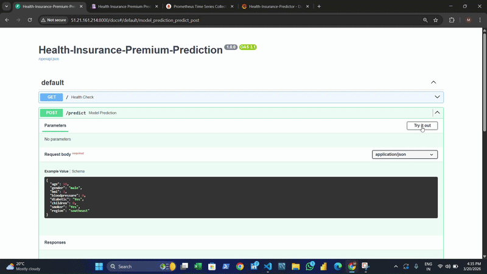

# Health Insurance Premium Predictor

<p align="center">
  
  
  
  
  
  
  
  
  
</p>

<p align="center">
  A fully automated, production-grade MLOps system that trains, evaluates, registers, containerizes,
  and deploys a machine learning model to AWS EC2 — triggered entirely by a single <code>git push</code>.
  Includes real-time monitoring via Prometheus and Grafana.
</p>

---

> [!WARNING]
> **AWS resources have been terminated due to cost constraints.**
> The EC2 instance, ECR registry, and S3 bucket are no longer running.
> All service links below will not respond.
> Screenshots and the demo video below capture the fully working system while live on AWS.

---

## Live Service URLs (while active)

| Service | URL | Status |
|---------|-----|--------|
| FastAPI App | [51.21.161.214:8000](http://51.21.161.214:8000) | Terminated |
| Swagger UI | [51.21.161.214:8000/docs](http://51.21.161.214:8000/docs) | Terminated |
| Prometheus | [51.21.161.214:9090](http://51.21.161.214:9090) | Terminated |
| Grafana | [51.21.161.214:3000](http://51.21.161.214:3000) | Terminated |
| MLflow / DagsHub | [dagshub.com/DataShoaib/Health-Insurance-Premium-predictor](https://dagshub.com/DataShoaib/Health-Insurance-Premium-predictor/) | Active |

---

## Demo



---

## Screenshots

| FastAPI Swagger UI | Prediction UI |
|:-:|:-:|
|  |  |

| Grafana Dashboard | Prometheus Metrics |
|:-:|:-:|
|  |  |

---

## Business Problem

Health insurance companies collect premiums upfront and pay out claims later — meaning every mispriced policy is a direct financial loss.

| Scenario | Impact |
|----------|--------|
| Premium set too low | Company pays more in claims than it collects |
| Premium set too high | Customers leave for competitors |

**Solution:** A data-driven regression model that predicts a customer's expected annual medical claim based on their health profile — enabling accurate, per-customer pricing at millisecond speed.

| KPI | Without ML | With ML |
|-----|-----------|---------|
| Pricing accuracy | Manual, rule-based broad tiers | Personalized per customer |
| Time to price | Days (manual underwriting) | Milliseconds (API call) |
| Claim ratio | High — many policies underpriced | Reduced — risk priced correctly |
| Profit margin | Thin estimates | Improved — data-driven decisions |

---

## System Architecture


```
Developer pushes to master
        │
        ▼
CI Pipeline (GitHub Actions)
  ├── Checkout code
  ├── Setup Python 3.12 + install dependencies
  ├── Configure AWS credentials
  ├── DVC pull  ──────────────────────── pulls versioned data from S3
  ├── DVC repro ──────────────────────── runs full 4-stage ML pipeline
  ├── Pytest ──── unit · integration · api · validation
  └── model_promote.py ──────────────── pushes best model → MLflow Production
        │ on success
        ▼
CD Pipeline (GitHub Actions)
  ├── DVC pull  ──────────────────────── pulls trained model for docker build
  ├── Docker build ───────────────────── packages app + model into image
  ├── Push to ECR ────────────────────── my-mlops-api:latest
  └── SSH into EC2
        ├── docker compose down
        ├── docker compose pull app
        ├── docker compose up -d
        └── curl health check
        │
        ▼
EC2 Instance
  ├── mlops-api    :8000   FastAPI
  ├── prometheus   :9090   Metrics scraper
  └── grafana      :3000   Dashboards
```

---

## Monitoring Stack


### Metrics Tracked

| Metric | Type | Description |
|--------|------|-------------|
| `predictions_total` | Counter | Total predictions served |
| `http_requests_total` | Counter | Requests by method, endpoint, status code |
| `http_request_duration_seconds` | Histogram | Request latency distribution |
| `last_predicted_claim_amount` | Gauge | Most recent prediction value |

### Run the monitoring stack

```bash
docker compose up -d
```

### Simulate traffic

```bash
python simulate_traffic.py
```

---

## MLflow Experiment Tracking

All experiments are tracked on **DagsHub** via the MLflow tracking server.

**[View MLflow Dashboard →](https://dagshub.com/DataShoaib/Health-Insurance-Premium-predictor/)**

- **Metrics:** `MAE`, `RMSE`, `R²` — logged after every training run
- **Parameters:** all hyperparameters defined in `config/params.yaml`
- **Artifacts:** serialized `model.pkl` + preprocessing pipeline
- **Model Registry:** `scripts/model_promote.py` compares the latest run against the current `Production` model and promotes automatically if performance improves

---

## DVC ML Pipeline

```
data/raw/insurance.csv
        │
        ▼
┌─────────────────────────────────────────┐
│  Stage 1: Data Ingestion                │
│  src/data/data_ingesion.py              │
│  • Load raw CSV                         │
│  • Drop nulls, fix data types           │
│  → data/interim/cleaned_data.csv        │
└────────────────────┬────────────────────┘
                     │
                     ▼
┌─────────────────────────────────────────┐
│  Stage 2: Feature Engineering           │
│  src/features/feature_engineering.py   │
│  • Encode: gender, smoker, diabetic,    │
│    diabetic, region                     │
│  • Stratified train / test split        │
│  → data/processed/ (x_train … y_test)  │
└────────────────────┬────────────────────┘
                     │
                     ▼
┌─────────────────────────────────────────┐
│  Stage 3: Model Building                │
│  src/model/model_building.py            │
│  • Train regression model               │
│  • Log params + artifact to MLflow      │
│  → models/model.pkl                     │
└────────────────────┬────────────────────┘
                     │
                     ▼
┌─────────────────────────────────────────┐
│  Stage 4: Evaluation                    │
│  src/evaluation/evaluation.py           │
│  • Compute MAE, RMSE, R²                │
│  • Log metrics to MLflow                │
│  → reports/metrics.json                 │
└────────────────────┬────────────────────┘
                     │
                     ▼
┌─────────────────────────────────────────┐
│  Stage 5: Model Promotion               │
│  scripts/model_promote.py               │
│  • Compare new run vs Production        │
│  • Promote best model → "Production"    │
└─────────────────────────────────────────┘
```

```bash
dvc repro           # re-run any outdated stages
dvc dag             # visualize full pipeline DAG
dvc metrics show    # display tracked evaluation metrics
dvc params diff     # compare parameter changes
```

---

## Model Features

| Feature | Type | Values | Business Relevance |
|---------|------|--------|--------------------|
| `age` | Numeric | 18 – 64 | Older customers → higher expected claims |
| `gender` | Categorical | male / female | Demographic risk adjustment |
| `bmi` | Numeric | 15 – 53 | High BMI → chronic disease risk |
| `bloodpressure` | Numeric | 60 – 140 | Cardiovascular risk indicator |
| `diabetic` | Categorical | Yes / No | High recurring treatment costs |
| `children` | Numeric | 0 – 5 | Family coverage scope |
| `smoker` | Categorical | Yes / No | #1 cost driver in insurance models |
| `region` | Categorical | northeast / northwest / southeast / southwest | Regional healthcare cost variation |

**Target:** `claim` — expected annual medical insurance claim (USD)

---

## API Reference

**Base URL:** `http://51.21.161.214:8000`

| Method | Endpoint | Description |
|--------|----------|-------------|
| `GET` | `/` | Health check |
| `POST` | `/predict` | Predict insurance claim amount |
| `GET` | `/metrics` | Prometheus metrics endpoint |
| `GET` | `/docs` | Swagger UI (interactive) |

### Request — `POST /predict`

```json
{
  "age": 28,
  "gender": "male",
  "bmi": 22.5,
  "bloodpressure": 80,
  "diabetic": "No",
  "children": 0,
  "smoker": "No",
  "region": "southeast"
}
```

### Response

```json
{
  "claim": 4306.84
}
```

---

## CI/CD Pipelines

### CI Pipeline — `ci.yaml`

**Trigger:** Push to `master`

| Step | Tool | Details |
|------|------|---------|
| Checkout | `actions/checkout@v4` | Fetch source code |
| Python setup | `actions/setup-python@v5` | Python 3.12 + pip cache |
| Install deps | `pip` | `requirements.txt` + `dvc[s3]` |
| AWS auth | `configure-aws-credentials@v4` | IAM credentials from secrets |
| Data pull | `dvc pull` | Download versioned data from S3 |
| ML pipeline | `dvc repro` | Run all 4 pipeline stages |
| Tests | `pytest` | unit + integration + API + validation |
| Model promote | `scripts/model_promote.py` | Push best model to MLflow Production |

### CD Pipeline — `cd.yaml`

**Trigger:** CI Pipeline completes with `success`

| Step | Tool | Details |
|------|------|---------|
| Checkout | `actions/checkout@v4` | Fetch source code |
| AWS auth | `configure-aws-credentials@v4` | IAM credentials from secrets |
| Model pull | `dvc pull` | Download trained model for Docker build |
| ECR login | `aws ecr get-login-password` | Authenticate Docker with ECR |
| Docker build | `docker build` | Package app + model into image |
| ECR push | `docker push` | Push `my-mlops-api:latest` to ECR |
| EC2 deploy | `appleboy/ssh-action@v1.0.3` | SSH → compose down → pull → up -d |
| Health check | `curl` | Verify app responds on port 8000 |

---

## AWS Infrastructure

| Service | Role |
|---------|------|
| **S3** | DVC remote — versioned datasets and model artifacts |
| **ECR** | Private Docker image registry |
| **EC2** | Production server — runs app, Prometheus, Grafana via docker-compose |
| **IAM** | Service accounts for GitHub Actions (push) and EC2 (pull) |

### GitHub Secrets Required

| Secret | Description |
|--------|-------------|
| `AWS_ACCESS_KEY_ID` | IAM user access key |
| `AWS_SECRET_ACCESS_KEY` | IAM user secret key |
| `AWS_DEFAULT_REGION` | e.g. `eu-north-1` |
| `AWS_ACCOUNT_ID` | 12-digit AWS account ID |
| `EC2_HOST` | EC2 instance public IP |
| `EC2_SSH_KEY` | Full PEM key content |
| `MLFLOW_TRACKING_URI` | DagsHub MLflow server URI |
| `MLFLOW_TRACKING_USERNAME` | DagsHub username |
| `DAGSHUB_TRACKING_PASSWORD` | DagsHub personal access token |

---

## Testing Strategy

A 4-layer test suite verifies every component independently before any deployment.

```
tests/
├── units/          →  each src/ module tested in isolation
├── integration/    →  full pipeline: raw input → model output
├── api/            →  FastAPI endpoint contract and response tests
└── validation/     →  model performance must exceed set thresholds
```

```bash
pytest                          # run all tests
pytest tests/units/             # unit tests only
pytest tests/integration/       # integration tests
pytest tests/api/               # API contract tests
pytest tests/validation/        # model performance thresholds
pytest --cov=src                # with coverage report
```

---

## Project Structure

```
Health-Insurance-Premium-Predictor/
│
├── .github/workflows/
│   ├── ci.yaml                      # Train → test → promote
│   └── cd.yaml                      # Build → ECR push → EC2 deploy
│
├── app/
│   ├── main.py                      # FastAPI routes + Prometheus metrics
│   ├── schema.py                    # Pydantic request/response models
│   ├── config.py                    # App settings (model path, version)
│   ├── model_app_predict.py         # Model loading and inference
│   └── utils.py                     # Shared helpers
│
├── src/
│   ├── data/
│   │   └── data_ingesion.py         # Load and clean raw CSV
│   ├── features/
│   │   └── feature_engineering.py  # Encode, scale, split
│   ├── model/
│   │   ├── model_building.py        # Train + MLflow log
│   │   ├── model_registry.py        # Register in MLflow Model Registry
│   │   └── utils.py
│   └── evaluation/
│       └── evaluation.py            # MAE, RMSE, R² + MLflow log
│
├── tests/
│   ├── units/
│   ├── integration/
│   ├── api/
│   ├── validation/
│   └── conftest.py
│
├── scripts/
│   └── model_promote.py             # Promote best run → Production
│
├── monitoring/
│   ├── prometheus.yml               # Scrape config (targets app:8000)
│   └── grafana_dashboard.json       # Exported Grafana dashboard
│
├── docs/
│   ├── mlops_pipeline.svg           # Architecture diagram
│   ├── monitoring_stack.svg         # Monitoring diagram
│   ├── screenshots/
│   │   ├── swagger_ui.png
│   │   ├── prediction_ui.png
│   │   ├── grafana_dashboard.png
│   │   └── prometheus_metrics.png
│   └── demo/
│       └── demo_video.mp4
│
├── data/                            # DVC tracked → S3
├── models/                          # DVC tracked → S3
├── reports/
│   ├── metrics.json
│   └── run_info.json
│
├── config/
│   └── params.yaml
│
├── notebook/
│   └── insurance_predictor.ipynb
│
├── logger/
├── simulate_traffic.py
├── docker-compose.yml
├── dockerfile
├── dvc.yaml
├── dvc.lock
├── requirements.txt
└── requirements-prod.txt
```

---

## Local Setup

```bash
# 1. Clone the repository
git clone https://github.com/DataShoaib/Health-Insurance-Premium-Predictor
cd Health-Insurance-Premium-Predictor

# 2. Create virtual environment
python -m venv venv
venv\Scripts\activate        # Windows
source venv/bin/activate     # Mac / Linux

# 3. Install dependencies
pip install -r requirements.txt

# 4. Set environment variables
# Add to .env: MLFLOW_TRACKING_URI, MLFLOW_TRACKING_USERNAME,
#              DAGSHUB_TRACKING_PASSWORD, AWS credentials

# 5. Pull versioned data from S3
dvc pull

# 6. Run the full ML pipeline
dvc repro

# 7. Run all tests
pytest

# 8. Start the API
uvicorn app.main:app --reload --host 0.0.0.0 --port 8000
# → http://localhost:8000/docs
```

---

## Tech Stack

| Layer | Tools |
|-------|-------|
| ML | scikit-learn · pandas · numpy |
| Experiment tracking | MLflow · DagsHub |
| Data versioning | DVC · AWS S3 |
| API | FastAPI · uvicorn · pydantic |
| Monitoring | Prometheus · Grafana |
| Containerization | Docker · docker-compose |
| Cloud | AWS EC2 · ECR · S3 · IAM |
| CI/CD | GitHub Actions |
| Testing | pytest · httpx · pytest-cov |

---

## Author

**Shoaib Akhtar**

MLOps &nbsp;·&nbsp; Machine Learning &nbsp;·&nbsp; AWS &nbsp;·&nbsp; Docker &nbsp;·&nbsp; GitHub Actions &nbsp;·&nbsp; DVC &nbsp;·&nbsp; MLflow &nbsp;·&nbsp; Prometheus &nbsp;·&nbsp; Grafana

---

*Built for portfolio and educational purposes.*
