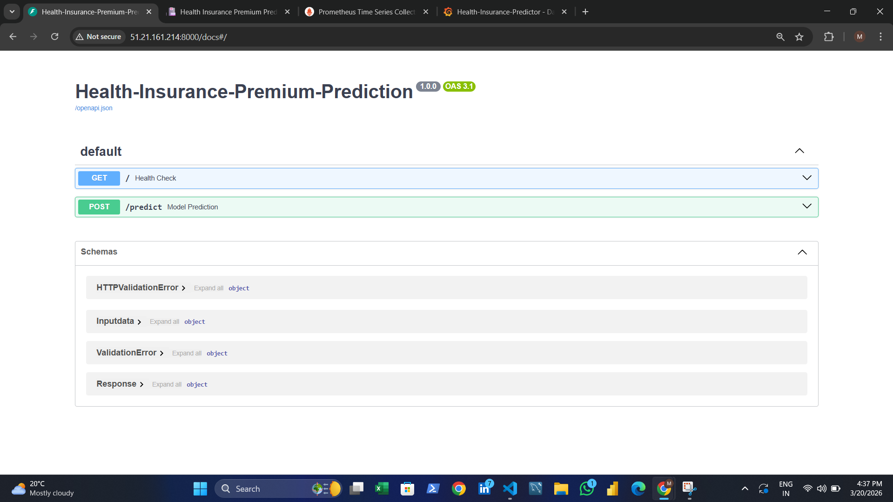
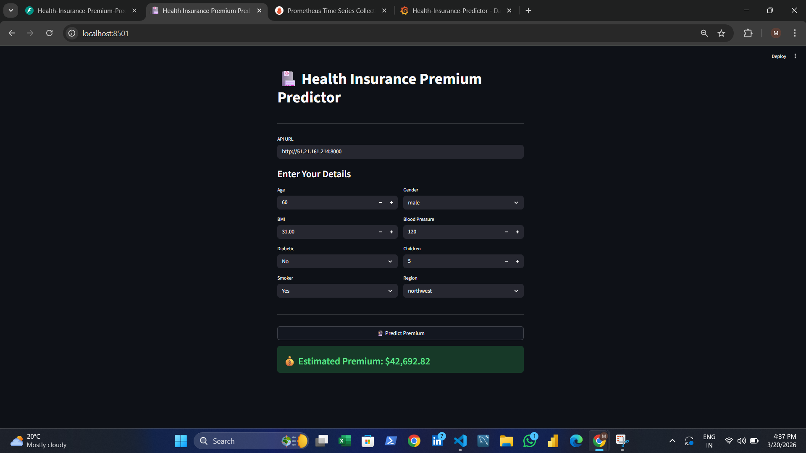
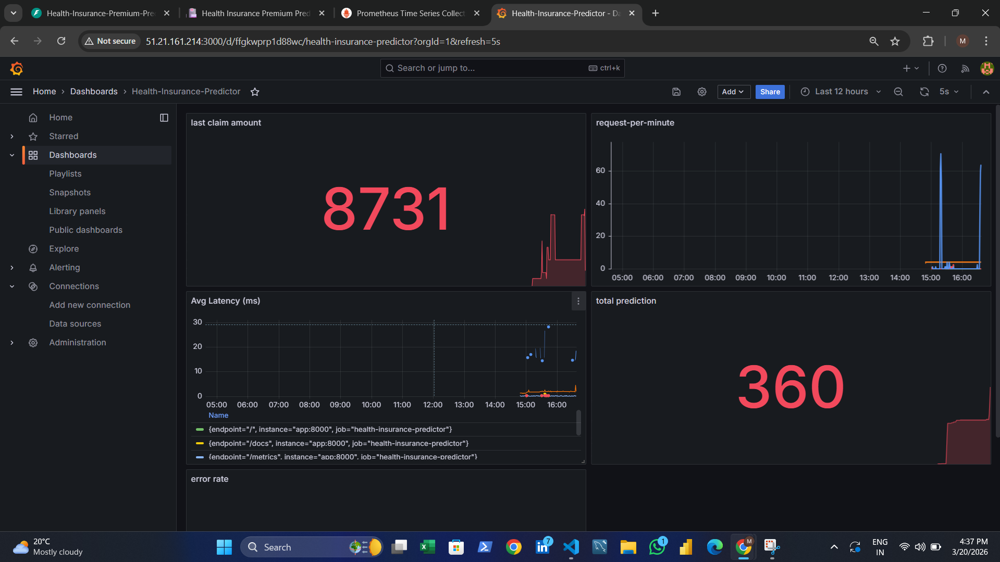
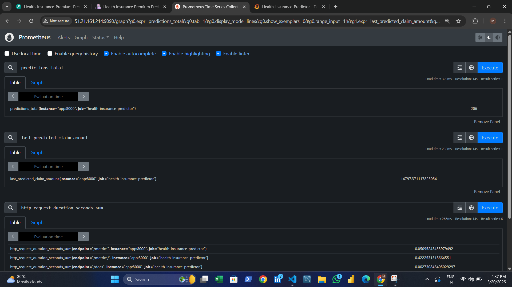
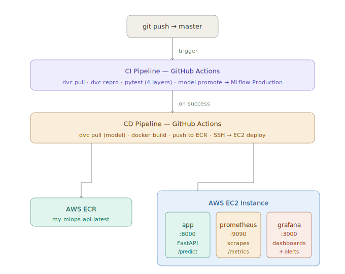
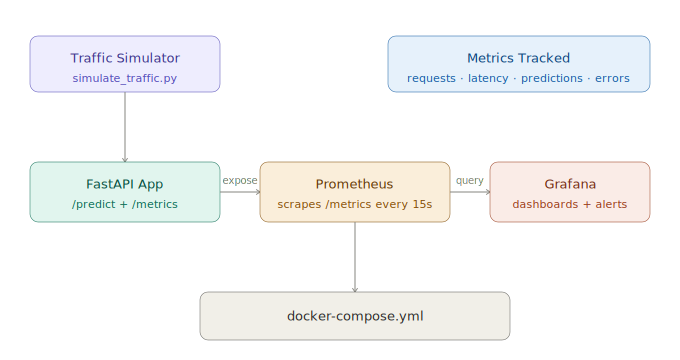

# Health Insurance Premium Predictor — End-to-End MLOps

<p align="center">
  
  
  
  
  
  
  
  
  
</p>

> A fully automated, production-grade MLOps system that trains, evaluates, registers,
> containerizes, and deploys a machine learning model to AWS EC2 — triggered entirely
> by a single `git push`. Includes real-time monitoring via Prometheus and Grafana.

> **Note:** AWS resources (EC2, ECR, S3) have been stopped after project completion
> due to cost constraints. All screenshots and demo video below show the live system
> in action.

---

## Demo

<video src="docs/demo/demo_video.mp4" controls width="100%"></video>

---

## Screenshots

| FastAPI Swagger UI | Prediction UI |
|:-:|:-:|
|  |  |

| Grafana Dashboard | Prometheus Metrics |
|:-:|:-:|
|  |  |

---

## Business Problem

Health insurance companies collect premiums upfront and pay claims later — meaning
every mispriced policy is a direct financial loss.

- **Too low** — company pays more in claims than it collects
- **Too high** — customers leave for competitors

**Solution:** A data-driven regression model that predicts a customer's expected annual
medical claim amount based on their health profile — enabling precise, per-customer
pricing in milliseconds.

### Business Impact

| KPI | Without ML | With ML |
|-----|-----------|---------|
| Pricing Accuracy | Manual, rule-based | Personalized per customer |
| Time to Price | Days (manual underwriting) | Milliseconds (API) |
| Claim Ratio | High — many policies underpriced | Reduced — risk priced correctly |
| Profit Margin | Thin estimates | Improved — data-driven |

---

## System Architecture



---

## Monitoring Stack



---

## Project Structure
```
Health-Insurance-Premium-Predictor/
│
├── .github/workflows/
│   ├── ci.yaml                      # Train → test → promote
│   └── cd.yaml                      # Build → push → deploy
│
├── app/
│   ├── main.py                      # FastAPI app + Prometheus metrics
│   ├── schema.py                    # Pydantic request/response models
│   ├── config.py                    # App settings
│   └── model_app_predict.py         # Model loading + inference
│
├── src/
│   ├── data/data_ingesion.py
│   ├── features/feature_engineering.py
│   ├── model/model_building.py
│   └── evaluation/evaluation.py
│
├── tests/
│   ├── units/
│   ├── integration/
│   ├── api/
│   └── validation/
│
├── scripts/
│   └── model_promote.py             # Promotes best model to MLflow Production
│
├── monitoring/
│   ├── prometheus.yml               # Scrape config — targets app:8000
│   └── grafana_dashboard.json       # Exported dashboard JSON
│
├── docs/
│   ├── mlops_pipeline.svg           # Architecture diagram
│   ├── monitoring_stack.svg         # Monitoring diagram
│   ├── screenshots/
│   │   ├── swagger_ui.png
│   │   ├── prediction_ui.png
│   │   ├── grafana_dashboard.png
│   │   └── prometheus_metrics.png
│   └── demo/
│       └── demo_video.mp4
│
├── data/                            # DVC tracked → S3
├── models/                          # DVC tracked → S3
├── reports/
│   ├── metrics.json
│   └── run_info.json
│
├── docker-compose.yml               # app + prometheus + grafana
├── dockerfile
├── dvc.yaml
├── dvc.lock
├── requirements.txt
└── requirements-prod.txt
```

---

## DVC ML Pipeline
```
data/raw/insurance.csv
        │
        ▼
Stage 1: Data Ingestion
        → data/interim/cleaned_data.csv
        │
        ▼
Stage 2: Feature Engineering
        → data/processed/ (x_train, x_test, y_train, y_test)
        │
        ▼
Stage 3: Model Building  →  MLflow log
        → models/model.pkl
        │
        ▼
Stage 4: Evaluation  →  MLflow metrics (MAE, RMSE, R²)
        → reports/metrics.json
        │
        ▼
Stage 5: Model Promotion
        → best model → MLflow Production
```
```bash
dvc repro           # run pipeline
dvc dag             # visualize DAG
dvc metrics show    # show evaluation metrics
```

---

## Model Features

| Feature | Type | Values |
|---------|------|--------|
| `age` | Numeric | 18 – 64 |
| `gender` | Categorical | male / female |
| `bmi` | Numeric | 15 – 53 |
| `bloodpressure` | Numeric | 60 – 140 |
| `diabetic` | Categorical | Yes / No |
| `children` | Numeric | 0 – 5 |
| `smoker` | Categorical | Yes / No |
| `region` | Categorical | northeast / northwest / southeast / southwest |

**Target:** `claim` — expected annual insurance claim (USD)

---

## Monitoring

Real-time monitoring via Prometheus and Grafana running alongside the app
on EC2 via docker-compose.

### Metrics Tracked

| Metric | Type | Description |
|--------|------|-------------|
| `predictions_total` | Counter | Total predictions served |
| `http_requests_total` | Counter | Requests by method, endpoint, status |
| `http_request_duration_seconds` | Histogram | Request latency distribution |
| `last_predicted_claim_amount` | Gauge | Most recent prediction value |

### Run monitoring stack
```bash
docker compose up -d
```

### Simulate traffic
```bash
python simulate_traffic.py
```

---

## API Reference

| Method | Endpoint | Description |
|--------|----------|-------------|
| GET | `/` | Health check |
| POST | `/predict` | Predict insurance claim |
| GET | `/metrics` | Prometheus metrics endpoint |
| GET | `/docs` | Swagger UI |

### Request — POST /predict
```json
{
  "age": 28,
  "gender": "male",
  "bmi": 22.5,
  "bloodpressure": 80,
  "diabetic": "No",
  "children": 0,
  "smoker": "No",
  "region": "southeast"
}
```

### Response
```json
{
  "claim": 4306.84
}
```

---

## CI/CD Pipelines

### CI Pipeline — ci.yaml

Trigger: push to `master`

| Step | Action |
|------|--------|
| Checkout | actions/checkout@v4 |
| Python 3.12 | setup + pip cache |
| AWS Auth | configure-aws-credentials@v4 |
| DVC Pull | download data from S3 |
| DVC Repro | run full ML pipeline |
| Pytest | unit + integration + api + validation |
| Model Promote | push best model to MLflow Production |

### CD Pipeline — cd.yaml

Trigger: CI completes with success

| Step | Action |
|------|--------|
| Checkout | actions/checkout@v4 |
| AWS Auth | configure credentials |
| DVC Pull | download trained model for docker build |
| ECR Login | authenticate docker with ECR |
| Docker Build | build image with model inside |
| ECR Push | push my-mlops-api:latest |
| EC2 Deploy | SSH → docker compose down → pull → up -d |
| Health Check | curl localhost:8000 |

---

## AWS Infrastructure

| Service | Role |
|---------|------|
| S3 | DVC remote — versioned datasets + model |
| ECR | Private Docker registry |
| EC2 | Production server — runs all 3 containers |
| IAM | Roles for GitHub Actions + EC2 ECR access |

### GitHub Secrets Required

| Secret | Description |
|--------|-------------|
| `AWS_ACCESS_KEY_ID` | IAM user access key |
| `AWS_SECRET_ACCESS_KEY` | IAM user secret key |
| `AWS_DEFAULT_REGION` | e.g. eu-north-1 |
| `AWS_ACCOUNT_ID` | 12-digit AWS account ID |
| `EC2_HOST` | EC2 public IP |
| `EC2_SSH_KEY` | Full PEM key content |
| `MLFLOW_TRACKING_URI` | DagsHub MLflow URI |
| `MLFLOW_TRACKING_USERNAME` | DagsHub username |
| `DAGSHUB_TRACKING_PASSWORD` | DagsHub access token |

---

## Local Setup
```bash
# 1. Clone
git clone https://github.com/DataShoaib/Health-Insurance-Premium-Predictor
cd Health-Insurance-Premium-Predictor

# 2. Virtual environment
python -m venv venv
venv\Scripts\activate        # Windows
source venv/bin/activate     # Mac/Linux

# 3. Install dependencies
pip install -r requirements.txt

# 4. Set environment variables
# Create .env with MLFLOW_TRACKING_URI, credentials

# 5. Pull data from S3
dvc pull

# 6. Run ML pipeline
dvc repro

# 7. Run tests
pytest

# 8. Start API
uvicorn app.main:app --reload --port 8000
# http://localhost:8000/docs
```

---

## Testing
```bash
pytest                     # all tests
pytest tests/units/        # unit tests
pytest tests/integration/  # integration tests
pytest tests/api/          # API contract tests
pytest tests/validation/   # model performance thresholds
pytest --cov=src           # with coverage
```

---

## Tech Stack

| Layer | Tools |
|-------|-------|
| ML | scikit-learn, pandas, numpy |
| Tracking | MLflow, DagsHub |
| Versioning | DVC, S3 |
| API | FastAPI, uvicorn, pydantic |
| Monitoring | Prometheus, Grafana |
| Container | Docker, docker-compose |
| Cloud | AWS EC2, ECR, S3, IAM |
| CI/CD | GitHub Actions |
| Testing | pytest, httpx |

---

## Author

**Shoaib Akhtar**

MLOps · Machine Learning · AWS · Docker · GitHub Actions · DVC · MLflow · Prometheus · Grafana

---

## License

Built for portfolio and educational purposes.
